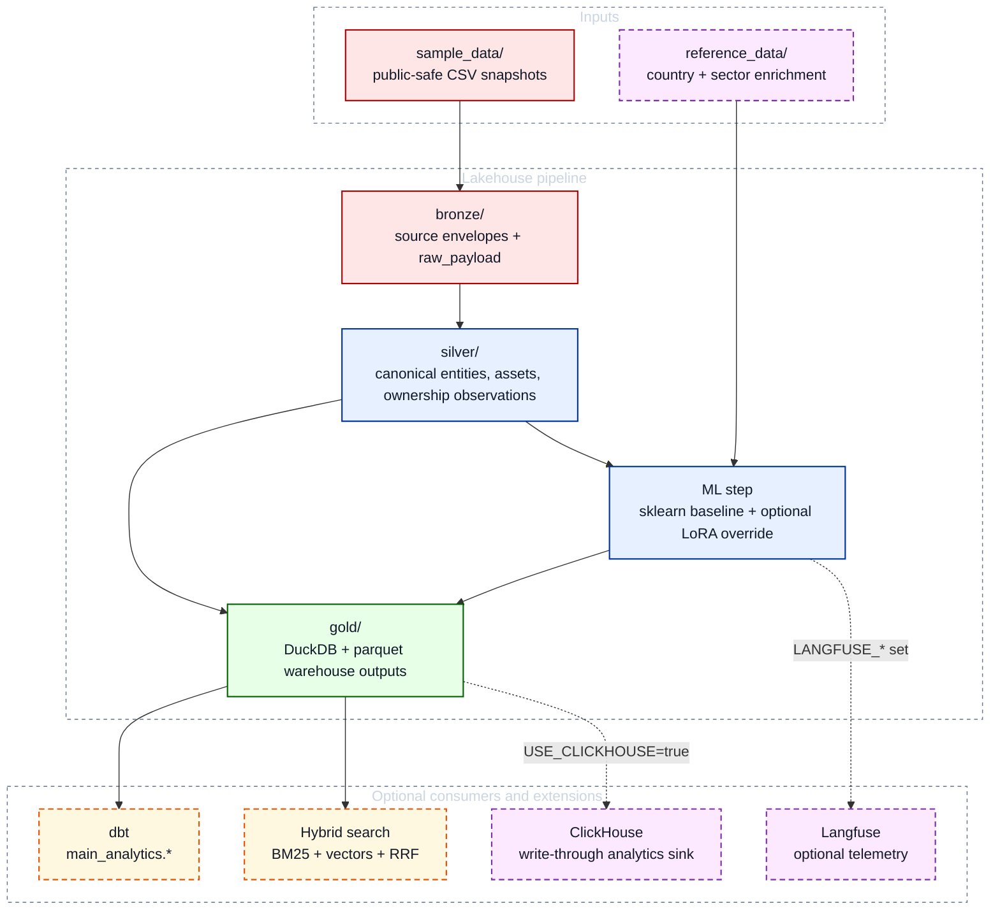

# Entity Data Lakehouse

`entity-data-lakehouse` is a public-safe reconstruction of a production-style entity and infrastructure lakehouse.
The interesting part is not dataset size. The interesting part is the contract around it: bronze -> silver -> gold layering, hybrid SCD warehouse outputs, deterministic rebuilds, and optional production-style extensions that do not compromise the default local DuckDB path.

## Why This Repo Is Worth Reviewing

| Signal | Why it matters |
|---|---|
| Bronze -> silver -> gold discipline | The repo demonstrates contract-driven staging instead of one-shot transformation scripts. |
| Hybrid warehouse outputs | Entity and ownership history are modeled with both SCD4 and SCD2 patterns so consumers can choose full observational fidelity or stable current/history tables. |
| Default-local, optional-production shape | DuckDB remains authoritative, while dbt, Airflow, ClickHouse, search, LoRA, and Langfuse are all explicit opt-ins. |
| Safe ML extension path | The sklearn baseline remains the default; the LoRA path is constrained, revision-pinned, trusted-root validated, and falls back cleanly when unavailable. |
| Rebuildable architecture demo | `sample_data/` plus bundled reference data are sufficient to rebuild the entire demo locally with no external services required. |

## Overview

The sample scenario combines:

- registry-style legal entities
- parent-child entity hierarchy data
- infrastructure asset ownership records

## Architecture At A Glance



See [docs/architecture.md](docs/architecture.md) and [docs/data_warehouse.md](docs/data_warehouse.md) for the detailed system view, warehouse design, and SCD2/SCD4 rationale.

This is the core idea the repo is trying to show: the pipeline is not just a few parquet writes. It is a staged warehouse pattern with explicit contracts, history-aware outputs, optional ML enrichment, and safe production-style extension points.

## Repository Map

- `sample_data/` bundled public-safe source snapshots
- `contracts/` output contracts for bronze, silver, and gold artifacts
- `dbt/` dbt-duckdb modelling project (analytics schema on top of gold)
- `scripts/run_demo.py` and `scripts/run_pipeline.py` local pipeline entrypoints
- `scripts/verify_public_safety.py` scans for banned company references and internal paths
- `src/entity_data_lakehouse/` pipeline implementation
- `bronze/`, `silver/`, `gold/` generated run artifacts; reproducible locally and ignored by default

## Quick Start with Docker

Primary run path:

```bash
docker compose up --build
```

Equivalent legacy command:

```bash
docker-compose up --build
```

Expected result:

- the bronze -> silver -> gold pipeline runs inside the container
- generated artifacts are written to `bronze/`, `silver/`, and `gold/`
- the retained gold mart is rebuilt in `gold/owner_infrastructure_exposure_snapshot.parquet`

To run tests in the same container image:

```bash
docker compose run --rm lakehouse pytest tests/
```

## Local Run

```bash
python3 -m pip install -e '.[dev]'
python3 scripts/run_demo.py
python3 scripts/verify_public_safety.py
pytest
```

The pipeline writes generated outputs to:

- `bronze/`
- `silver/`
- `gold/`

These directories are generated artifacts for local runs. They are intentionally reproducible and ignored by default rather than treated as hand-maintained source files.

## Published Outputs

### Bronze

Each local pipeline run writes source snapshots to:

```text
bronze/source=<source>/snapshot_date=<date>/records.parquet
```

The bronze contract preserves key matching fields plus a `raw_payload` JSON blob for unmapped attributes.
In this repo, bronze outputs are generated locally from bundled sample data.

### Silver

- `entity_observations.parquet`: observation-grain entity rows for DW input
- `entity_master.parquet`: canonical entities with match basis and source lineage
- `asset_master.parquet`: infrastructure asset dimension
- `ownership_observations.parquet`: observation-grain ownership rows for DW input
- `relationship_edges.parquet`: `OWNS_ASSET`, `OPERATES_ASSET`, and `PARENT_OF_ENTITY` edges

These are generated outputs, not source-controlled assets.

### Gold

- `gold/dw/entity_master_comprehensive_scd4.parquet`
- `gold/dw/entity_master_current.parquet`
- `gold/dw/entity_master_event_log.parquet`
- `gold/dw/ownership_comprehensive_scd4.parquet`
- `gold/dw/ownership_lifecycle.parquet`
- `gold/dw/ownership_history_scd2.parquet`
- `gold/dw/ownership_current.parquet`
- `gold/owner_infrastructure_exposure_snapshot.parquet`
- `gold/entity_lakehouse.duckdb`

Gold uses a hybrid warehouse pattern inspired by the original reference repo:

- SCD4 for entity master snapshots and source-adaptive ownership observations
- lifecycle metrics to separate coverage drift from business change
- SCD2 current/history tables for stable ownership consumption
- a derived analytics mart that preserves the existing public contract

These gold artifacts are also generated locally and can be rebuilt from `sample_data/` with `python3 scripts/run_demo.py`.

## dbt Modelling Layer

A dbt-duckdb project re-models the gold-layer DuckDB tables into a separate `main_analytics` schema, leaving the upstream `main.dw_*` / `main.mart_*` / `main.ml_*` tables untouched.

```bash
pip install -e '.[dbt]'
python3 scripts/run_demo.py          # populate upstream gold tables first
make dbt-run                         # materialise main_analytics.* models
make dbt-test                        # run schema + singular data-quality tests
```

Or directly:

```bash
cd dbt && dbt run --profiles-dir . && dbt test --profiles-dir .
```

Models land in `main_analytics.*` inside `gold/entity_lakehouse.duckdb`. See [docs/data_warehouse.md](docs/data_warehouse.md) for details.

## Apache Airflow DAG

An Airflow DAG wraps the full pipeline for orchestration demo purposes, runnable via Docker:

```bash
docker compose build airflow
docker compose up airflow
make airflow-up
```

UI: `http://localhost:8080`
Login: `AIRFLOW_ADMIN_USER` / `AIRFLOW_ADMIN_PASSWORD` from your `.env`

The DAG `entity_lakehouse_pipeline` runs three tasks in sequence:
`run_pipeline_stages` → `run_dbt` → `run_public_safety_scan`.

Uses `SequentialExecutor` + SQLite (Airflow 2.9 recommended dev configuration).
See [airflow/README.md](airflow/README.md) and [docs/architecture.md](docs/architecture.md) for details.

## Hybrid Search Demo

An optional hybrid search layer queries the entity master using **BM25 + dense vector retrieval + Reciprocal Rank Fusion (RRF)**.

**Architecture:**

| Layer | Implementation | Role |
|---|---|---|
| BM25 leg | `bm25s` (pure-Python, tunable k1/b, numpy backend) | Exact keyword matching, proper-noun precision |
| Dense leg | `sentence-transformers/all-MiniLM-L6-v2` + Qdrant (local mode) | Semantic similarity |
| Fusion | Reciprocal Rank Fusion (k=60, Cormack et al. 2009) | Rank-based merge — no score normalisation needed |
| Storage | Qdrant on-disk (`gold/qdrant_store/`) | Reused when the corpus/model fingerprint matches |

**Install search extras:**

```bash
pip install -e '.[search]'
```

**Run the pipeline first** (builds `gold/entity_lakehouse.duckdb`):

```bash
python scripts/run_demo.py
```

**CLI search:**

```bash
python scripts/search_demo.py "solar energy Germany"
python scripts/search_demo.py "infrastructure holding" --top-k 3
```

**FastAPI server:**

```bash
uvicorn entity_data_lakehouse.api:app --reload --port 8000
curl "http://localhost:8000/search?q=solar+Germany&top_k=3"
curl "http://localhost:8000/health"
```

The `ENTITY_DUCKDB_PATH` environment variable overrides the default DuckDB path.

**What the output shows:**

```
Rank  RRF Score    BM25↑   Vec↑    Entity                              Country  Type
----  -----------  ------  ------  ----------------------------------  -------  --------
1     0.030769     1       2       Acme Solar Holdings GmbH            DE       OPERATOR
2     0.028571     2       1       Nordic Wind Energy AS               NO       OPERATOR
...
```

- `BM25↑` / `Vec↑` — rank in each individual list (lower = more relevant).  `—` means the entity was not in that list's top candidates.
- `RRF Score` — fused rank score; higher is better.

**Design notes:**

- `bm25s` builds the BM25 inverted index entirely in memory (no DuckDB writes) with tunable `k1=1.5` (term-frequency saturation) and `b=0.75` (document-length normalisation) parameters.  This replaces the DuckDB FTS extension, which offered no tunable k1/b parameters and rebuilt the index on every call.
- Qdrant runs in local on-disk mode (`gold/qdrant_store/`); persisted vectors are reused only when the stored corpus/model fingerprint matches the current entity master.  Pass `qdrant_path=Path(":memory:")` in tests or demos where persistence is unwanted.
- The RRF constant k=60 is the standard value from the original paper; it prevents top-ranked items in a single list from dominating when the other list has no match.
- Linear score combination (e.g. `0.7 * vector + 0.3 * bm25`) is intentionally avoided: raw BM25 and cosine scores are not comparable and are not linearly separable in score space.

## LoRA Fine-Tuning Demo

An optional LoRA path overrides only the lifecycle-stage classification columns:

- `predicted_lifecycle_stage`
- `lifecycle_stage_confidence`

All other ML outputs, including retirement year and capacity factor, remain on the sklearn baseline.
When `ML_BACKEND` is unset, `ml_lora` is not imported and behaviour is identical to the default path.

**What is implemented:**

- teacher-forced label scoring over the full stage token sequence, not `generate()`
- chunked batched inference for throughput, with per-row retry if a chunk fails
- clean sklearn fallback when the adapter is missing, invalid, or the optional deps are unavailable
- pinned base model and pinned revision, persisted as `adapter_metadata.json`
- trusted adapter root validation: `LORA_ADAPTER_PATH` must resolve under `models/`

**Hardware:** MPS (Apple Silicon) or CUDA recommended. CPU is functional but slow.

```bash
pip install -e '.[lora]'

# Train adapter on synthetic data:
python scripts/train_lora.py --samples 200 --epochs 1

# Optional: train against an explicit pinned revision
python scripts/train_lora.py --samples 200 --epochs 1 --revision "$LORA_BASE_MODEL_REVISION"

# Evaluate LoRA vs sklearn baseline:
python scripts/eval_lora.py

# Run pipeline with LoRA lifecycle-stage override:
ML_BACKEND=lora python scripts/run_demo.py

# Default baseline path:
python scripts/run_demo.py
```

See [docs/architecture.md](docs/architecture.md) for the loading constraints, fallback model, and observability design.

## Eval Harness

A standalone eval harness compares the sklearn baseline against the LoRA adapter
(when available) on a held-out synthetic test set:

```bash
make eval
# or directly:
python evals/run_evals.py
```

The report is written to `evals/output/latest_report.json` and includes accuracy,
per-class F1, and runtime for both backends. The LoRA entry is skipped gracefully
if the adapter has not been trained or fails validation.

## ClickHouse Analytics Backend (optional)

By default the pipeline writes only to DuckDB (`gold/entity_lakehouse.duckdb`).
An optional ClickHouse sink is available for production-style OLAP queries, but DuckDB remains the source of truth.

**Start with ClickHouse:**

```bash
USE_CLICKHOUSE=true docker compose --profile clickhouse up --build
# or via Makefile:
make clickhouse-up
```

**Stop:**

```bash
make clickhouse-down
```

The sink auto-creates the `lakehouse` database (or `CLICKHOUSE_DATABASE` if overridden)
and then creates three MergeTree tables:

| Table | Contents |
|---|---|
| `ownership_current` | Current ownership positions |
| `owner_infrastructure_exposure_snapshot` | Per-owner exposure snapshots |
| `ml_asset_lifecycle_predictions` | ML lifecycle predictions |

Each sink load is an atomic full refresh:

- rows are first written into staging tables
- live and staging tables are swapped with `EXCHANGE TABLES`
- already-swapped tables are rolled back if a later table fails
- the successful `batch_id` is only published after all three tables refresh

This keeps DuckDB authoritative while ensuring ClickHouse readers never see partially refreshed live tables.

The `lakehouse` service is a no-op when `USE_CLICKHOUSE` is unset or `false`; the
default `docker compose up --build` path is unaffected.

**Connection config** (all optional; shown with defaults):

```bash
CLICKHOUSE_HOST=clickhouse
CLICKHOUSE_PORT=8123
CLICKHOUSE_DATABASE=lakehouse
CLICKHOUSE_USER=default
CLICKHOUSE_PASSWORD=
CLICKHOUSE_SECURE=false
CLICKHOUSE_VERIFY=true
CLICKHOUSE_ALLOW_INSECURE_PRIVATE_NETWORK=false
```

Copy `.env.example` to `.env` to configure locally.

**Security notes:**

- the compose file binds ClickHouse to `127.0.0.1`
- plaintext HTTP is rejected for non-local/public hosts
- `CLICKHOUSE_ALLOW_INSECURE_PRIVATE_NETWORK=true` is only intended for trusted private or compose networks, never public hosts
- the Airflow service requires an explicit `AIRFLOW_ADMIN_PASSWORD` in `.env`

## Observability (optional)

ML, training, and eval traces can be forwarded to [Langfuse](https://langfuse.com):

```bash
pip install -e '.[observability]'
```

Set credentials in `.env` (see `.env.example`):

```bash
LANGFUSE_PUBLIC_KEY=pk-lf-...
LANGFUSE_SECRET_KEY=sk-lf-...
LANGFUSE_HOST=https://cloud.langfuse.com   # or your self-hosted URL
```

Current telemetry surface:

| Event | Source |
|---|---|
| `sklearn_build_ml_predictions` trace + `build_ml_predictions` span | `ml.py` |
| `lifecycle_lora_batch_chunk` generation | `ml_lora.py` chunk-level aggregate telemetry |
| `lora_training` trace + `train_lora_adapter` span | `scripts/train_lora.py` |
| `eval_lora` trace | `scripts/eval_lora.py` |

When credentials are absent the repo still runs normally: a one-time warning is emitted and all Langfuse calls degrade to no-ops. Telemetry failures are intentionally non-fatal in both the pipeline and the training script.

## Where To Look First

| If you care about... | Start here |
|---|---|
| End-to-end pipeline orchestration | `src/entity_data_lakehouse/pipeline.py` and `scripts/run_demo.py` |
| Bronze/silver/gold modeling | `src/entity_data_lakehouse/bronze.py`, `silver.py`, `gold.py` |
| Warehouse semantics and SCD rationale | `docs/data_warehouse.md` |
| Optional ClickHouse sink behavior | `src/entity_data_lakehouse/clickhouse_sink.py` |
| Baseline ML plus optional LoRA override | `src/entity_data_lakehouse/ml.py` and `ml_lora.py` |
| Hybrid retrieval and API surface | `src/entity_data_lakehouse/search.py` and `api.py` |
| Optional observability boundary | `src/entity_data_lakehouse/observability.py` |

## Public-Safe Boundaries

What this repo preserves from the production pattern:

- staged medallion execution flow
- entity resolution and relationship modeling shape
- SCD2/SCD4 warehouse design
- optional orchestration, ML, search, OLAP, and observability extension points
- local rebuildability and contract-driven outputs

What is intentionally generalized or removed:

- proprietary business rules and private source systems
- internal datasets and rollout controls
- company-specific credentials, URLs, and infrastructure paths
- any requirement for private services to run the default demo
