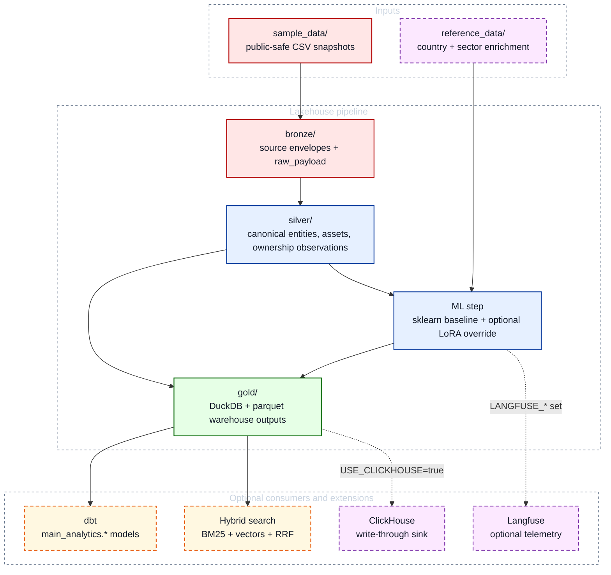

# Architecture

`entity-data-lakehouse` is a public-safe reconstruction of a production-style entity and infrastructure lakehouse.
The repo is designed to demonstrate layered contracts, optional production add-ons, and safe degradation: the default DuckDB path always works, while ClickHouse, LoRA, Airflow, hybrid search, and Langfuse remain opt-in.

The repo demonstrates two distinct workload properties:

- **ML quality / latency / cost benchmarking** — sklearn baseline vs optional LoRA adapter with runtime and equivalent-cloud USD estimates
- **Rollback-safe analytics publication** — `publish_mode=dry_run|commit` with a machine-readable `publish_report.json` artifact covering row counts, rollback status, and sink target summary

## System View



## Flow

1. `sample_data/` stores bundled public-safe CSV snapshots for:
   - registry-style entities
   - parent-child entity hierarchy
   - infrastructure asset ownership
2. `bronze/` receives a standardized envelope per source record with typed matching fields and a `raw_payload` JSON blob.
3. `silver/` resolves canonical entities, standardizes asset dimensions, and emits both observation-grain tables and convenience outputs.
4. `gold/` publishes a hybrid warehouse-oriented model and a local DuckDB database for ad hoc analysis.
5. The ML step enriches assets with geographic and economic features from `reference_data/`, trains the sklearn baseline on synthetic reference data, and writes lifecycle predictions to `gold/dw/asset_lifecycle_predictions.parquet`.
6. When `ML_BACKEND=lora`, the lifecycle-stage columns can be overridden by a constrained LoRA adapter while retirement year and capacity factor remain on sklearn.
7. Optional hybrid search queries the current entity master with `bm25s`, sentence-transformer embeddings, local Qdrant persistence, and Reciprocal Rank Fusion.
8. Optional ClickHouse writes the final DuckDB-backed analytics tables into a production-style OLAP sink.

## Entity Resolution

The silver layer uses a fixed match hierarchy:

1. `registry_entity_id`
2. `lei`
3. `source_entity_id`
4. `(normalized_name, country_code)`

Names are normalized with accent stripping, punctuation removal, case folding, and whitespace collapsing.

## Silver Outputs

- `silver/entity_observations.parquet`
- `silver/entity_master.parquet`
- `silver/asset_master.parquet`
- `silver/ownership_observations.parquet`
- `silver/relationship_edges.parquet`

## Gold Outputs

- `gold/dw/entity_master_comprehensive_scd4.parquet`
- `gold/dw/entity_master_current.parquet`
- `gold/dw/entity_master_event_log.parquet`
- `gold/dw/ownership_comprehensive_scd4.parquet`
- `gold/dw/ownership_lifecycle.parquet`
- `gold/dw/ownership_history_scd2.parquet`
- `gold/dw/ownership_current.parquet`
- `gold/owner_infrastructure_exposure_snapshot.parquet`
- `gold/entity_lakehouse.duckdb`

## ML Outputs

- `gold/dw/asset_lifecycle_predictions.parquet` — per-asset lifecycle stage, retirement year, and capacity factor predictions with all enrichment features for explainability
- `entity_lakehouse.duckdb` → table `ml_asset_lifecycle_predictions`

## ML Enrichment Sources

- `reference_data/country_attributes.csv` — 29 countries with geographic and economic attributes (latitude/longitude, altitude, territorial type, GDP tier, solar irradiance, wind speed, regulatory stability)
- `reference_data/sector_lifecycle.csv` — sector lifecycle parameters for solar, wind, and storage (lifespan ranges, construction/decommissioning duration, base capacity factor, geographic sensitivity coefficients)

## History Awareness

The demo includes three snapshots.

- entity master uses SCD4 to preserve all observation snapshots and derive a current master plus event log
- ownership uses SCD4 plus lifecycle metrics to measure presence, gaps, and reliability across releases
- downstream ownership consumption uses SCD2 current/history tables
- the public mart still reports `NEW`, `CHANGED`, `UNCHANGED`, and `DROPPED` by snapshot
- ML lifecycle predictions use the ownership lifecycle signal (presence rate, reliability score, snapshot count) as features alongside geographic enrichment

## Airflow DAG

An Apache Airflow DAG (`airflow/dags/entity_lakehouse_dag.py`) wraps the full pipeline
for orchestration demo purposes.

### DAG: `entity_lakehouse_pipeline`

```
run_pipeline_stages  >>  run_dbt  >>  run_public_safety_scan
```

| Task | Type | Action |
|---|---|---|
| `run_pipeline_stages` | PythonOperator | Calls `run_pipeline(repo_root, publish_mode=PUBLISH_MODE)` — bronze → silver → gold → ML |
| `run_dbt` | PythonOperator | `commit`: `dbt run && dbt test`; `dry_run`: returns early (no dbt execution — no gold artefacts to materialise) |
| `run_public_safety_scan` | BashOperator | `python verify_public_safety.py` (both modes) |

`PUBLISH_MODE` is read from the Airflow Variable `PUBLISH_MODE` (set via Airflow UI or
API), falling back to the `PUBLISH_MODE` environment variable, and then to `"commit"`.
See `airflow/README.md` for details.

The DAG uses `schedule=None` (manual trigger) and runs with `SequentialExecutor` +
SQLite, which is the recommended configuration for single-machine demo deployments of
Airflow 2.9.

### Running

```bash
docker compose build airflow
docker compose up airflow
# or:
make airflow-up
```

UI: `http://localhost:8080`
Login: `AIRFLOW_ADMIN_USER` / `AIRFLOW_ADMIN_PASSWORD` from `.env`

See `airflow/README.md` for detailed local dev instructions.

## Analytics Storage

DuckDB is the primary analytics store and source of truth.  All queries,
validation, and failure handling centre on DuckDB.  ClickHouse is an optional
write-through sink — it receives the same rows already written to DuckDB and
is intended for production-scale OLAP workloads.  This is a
**DuckDB-authoritative, ClickHouse-optional** architecture; ClickHouse is not a
backend switch and does not replace DuckDB.

```text
gold/entity_lakehouse.duckdb   ← primary store (always written in commit mode)
        |
        +--[USE_CLICKHOUSE=true]--> ClickHouse write-through sink
                                    lakehouse.ownership_current
                                    lakehouse.owner_infrastructure_exposure_snapshot
                                    lakehouse.ml_asset_lifecycle_predictions
```

**DuckDB** — embedded, zero-infrastructure, suitable for local and CI use.
Default path; `docker compose up --build` works without any extra flags.

**ClickHouse** — optional MergeTree sink for production-style OLAP queries.
Not a backend switch; DuckDB remains authoritative.

```bash
USE_CLICKHOUSE=true docker compose --profile clickhouse up --build
# or:
make clickhouse-up
```

The ClickHouse service is defined under the `clickhouse` compose profile so
that `docker compose up --build` (default path) is completely unaffected.
A healthcheck gates both the `lakehouse` and `airflow` services so the sink is
ready before the first insert attempt.

On startup the sink creates the target database if needed, then loads each table
with atomic full-refresh semantics:

- write rows into staging tables
- swap staging and live tables with `EXCHANGE TABLES`
- roll back already-swapped tables if a later refresh fails
- publish the final `batch_id` to `lakehouse_batch_log` only after all three tables succeed

Readers can pin to the latest successful batch by consulting `lakehouse_batch_log`,
which avoids partially published snapshots.

The DDL column sets in `clickhouse_sink.py` are derived directly from the gold
output contracts.  If the DataFrame arriving at the sink has missing or extra
columns relative to the declared contract, a `ValueError` is raised immediately —
no silent fabrication of default values occurs.

### Non-goals

- No streaming / Kafka path — the pipeline is batch-oriented by design.
- ClickHouse is not a replacement for bronze/silver/gold parquet files or DuckDB.
- No schema migration tooling — DDL uses `CREATE DATABASE IF NOT EXISTS` and
  `CREATE TABLE IF NOT EXISTS`; schema changes require a manual `DROP TABLE` or
  `ALTER TABLE`, followed by a reload.

## Safe Batch Publication

Every pipeline run emits `gold/publish_report.json` (or a custom path via
`--report-path`).  The report is the authoritative machine-readable artifact for
a run's publication outcome.

### `publish_mode=dry_run`

- All computation (bronze → silver → gold → ML) runs identically.
- All contract validations run (`validate_dataframe`, `scan_public_safety`).
- ClickHouse sink schemas are validated via `validate_sink_schema()` without connecting.
- **Minimal disk writes**: no parquet, no DuckDB, no ClickHouse mutations.
- The only file written is `publish_report.json` (its parent directory is created if it does not already exist).
- Useful for CI preflight, demo review, and pre-publish checks.

> **Airflow note:** when triggered via the Airflow DAG, `dry_run` additionally causes the
> `run_dbt` task to return early (no dbt execution) because dbt requires the gold DuckDB file and parquet outputs that
> `dry_run` intentionally does not produce.  The `run_public_safety_scan` task still runs.

### `publish_mode=commit` (default)

- Full pipeline with all disk writes and optional ClickHouse sink.
- Behaviour is identical to the pre-publish-mode baseline.
- `publish_report.json` is written alongside normal artifacts.

### `publish_report.json` schema

```json
{
  "schema_version": "1",
  "report_timestamp": "2026-...",
  "run_id": "<uuid12>",
  "publish_mode": "dry_run | commit",
  "status": "success | failed",
  "tables_attempted": ["ownership_current", "owner_infrastructure_exposure_snapshot", "ml_asset_lifecycle_predictions"],
  "row_counts": {"entity_master_rows": 6, "asset_master_rows": 5, "...": "..."},
  "rollback_status": "not_applicable | clean | rolled_back | partial_rollback_failed",
  "sink_target": {
    "clickhouse_enabled": true,
    "tables_refreshed": ["..."],
    "batch_id": "...",
    "status": "success | skipped | not_started | failed | dry_run_validated | dry_run_schema_failed",
    "schema_validations": [{"table": "...", "status": "passed", "error": null}]
  },
  "public_safety": {"status": "passed", "findings": []},
  "artifacts_written": ["gold/dw/ownership_current.parquet", "..."]  // gold artefacts only; empty in dry_run
}
```

`rollback_status` transitions:

| Value | Meaning |
|---|---|
| `not_applicable` | ClickHouse disabled; no rollback needed |
| `clean` | All tables refreshed successfully; old staging tables dropped |
| `rolled_back` | Partial failure; already-swapped tables were re-exchanged back to prior live data |
| `partial_rollback_failed` | Partial failure and at least one rollback exchange also failed; manual recovery needed |

## Observability

When `LANGFUSE_PUBLIC_KEY` and `LANGFUSE_SECRET_KEY` are set, the pipeline emits
traces and generation events to Langfuse:

| Event | Source |
|---|---|
| `sklearn_build_ml_predictions` trace + `build_ml_predictions` span | `ml.py` — wraps the full baseline prediction step |
| `lifecycle_lora_batch_chunk` generation | `ml_lora.py` — chunk-level aggregate telemetry: runtime, attempted/successful throughput, cost proxy, USD estimate |
| `lora_training` trace + `train_lora_adapter` span | `scripts/train_lora.py` |
| `eval_lora` trace | `scripts/eval_lora.py` |
| `evals_run` trace + scores | `evals/run_evals.py` — accuracy scores, runtime/cost benchmark metadata, pricing profile |

When credentials are absent, all Langfuse calls are no-ops (one warning on first use).
Telemetry setup, `span.end()`, and `flush()` failures are intentionally non-fatal in both the pipeline and the training CLI.

## Eval Harness

`evals/run_evals.py` compares sklearn and LoRA on a held-out synthetic test set:

```bash
make eval
```

The report is written to `evals/output/latest_report.json`.  The harness is
**runtime- and cost-aware**: `*_runtime_s` fields measure inference time,
training time is reported separately in `*_training_runtime_s`, and cost
fields use an equivalent-cloud rate card.  The report is nested into
`sklearn`, `lora`, and `comparison` sub-dicts.  Schema (abbreviated —
see `evals/output/latest_report.json` for the full current output):

```json
{
  "schema_version": "2",
  "report_timestamp": "...",
  "test_samples": 60,
  "cost_estimate_method": "equivalent_cloud_rate_card",
  "pricing_profile": "benchmark_local_equivalent_v1",
  "pricing_assumptions": {
    "sklearn_usd_per_hour": 0.20,
    "lora_train_usd_per_hour": 1.00,
    "lora_infer_usd_per_hour": 1.00,
    "lora_amortization_samples": 10000,
    "notes": "Equivalent benchmark rates for local runs; not actual billed cloud cost.",
    "stored_pricing_profile": null,
    "stored_pricing_notes": null
  },
  "cost_proxy_unit": "compute_seconds",
  "sklearn": {
    "accuracy": 0.82,
    "f1_per_class": {"...": "..."},
    "training_runtime_s": 1.0,
    "runtime_s": 0.4,
    "training_estimated_cost_usd": 0.00006,
    "estimated_cost_usd": 0.000002,
    "cost_per_sample_usd": 0.000001
  },
  "lora": {
    "adapter_present": false,
    "available": false,
    "inference_healthy": null,
    "model_load_s": null,
    "runtime_s": null,
    "training_runtime_s": null,
    "estimated_cost_usd": null,
    "cost_per_sample_usd": null,
    "amortized_cost_per_sample_usd": null,
    "effective_train_usd_per_hour": null,
    "..."
  },
  "comparison": {
    "accuracy_delta_lora_minus_sklearn": null,
    "runtime_ratio_lora_to_sklearn": null,
    "cost_ratio_lora_to_sklearn": null
  },
  "quality_latency_tradeoff_summary": "...",
  "schema_valid": true
}
```

Key report semantics:

- `lora.model_load_s` — adapter and tokenizer load time, split from pure inference so `lora.runtime_s` is directly comparable to sklearn timing.
- `comparison.*_ratio` fields are `null` when `lora.available` is `false`.
- `pricing_assumptions.stored_pricing_profile` / `stored_pricing_notes` — rate-card provenance recovered from the adapter's `adapter_metadata.json` at training time; `null` when no adapter is present.
- USD values are **estimates derived from a declared rate card**, not actual billed cloud cost.

Rate-card defaults can be overridden via environment variables (see `.env.example`).

### Design

| Component | Description |
|---|---|
| `src/entity_data_lakehouse/ml.py` | Baseline sklearn training/inference, optional LoRA override wiring, fallback-to-sklearn behavior |
| `src/entity_data_lakehouse/ml_lora.py` | Prompt construction, JSONL generation, constrained adapter training, validated loading, teacher-forced inference |
| `src/entity_data_lakehouse/benchmark_costs.py` | Shared cost model: rate-card loading, proxy and USD estimation, amortization, tradeoff summary |
| `scripts/train_lora.py` | CLI to generate synthetic JSONL and fine-tune the adapter on the pinned base model + revision; records training benchmark metadata |
| `scripts/eval_lora.py` | Accuracy / F1 / confusion matrix: LoRA vs sklearn baseline |
| `models/lifecycle_lora_adapter/` | Saved PEFT adapter weights plus `adapter_metadata.json` provenance and training benchmark summary |

Base model: `Qwen/Qwen2.5-0.5B-Instruct`
Pinned default revision: `BASE_MODEL_REVISION` in `ml_lora.py` (overrideable via `LORA_BASE_MODEL_REVISION` or `scripts/train_lora.py --revision`)

### Adapter path resolution

The adapter directory is resolved from `gold_root.parent / "models" / "lifecycle_lora_adapter"`,
or overridden via `LORA_ADAPTER_PATH`.

Guardrails:

- the resolved path must remain under the trusted `models/` root
- symlink escape and `..` escape are rejected
- the path must be a directory
- `adapter_metadata.json` is required and must contain the exact training revision
- the adapter base model must match the pinned `BASE_MODEL`

### Usage

```bash
pip install -e '.[lora]'

# 1. Train the adapter (~5 min on MPS / GPU):
python scripts/train_lora.py --samples 200 --epochs 1

# Optional: train against an explicit revision override:
python scripts/train_lora.py --samples 200 --epochs 1 --revision "$LORA_BASE_MODEL_REVISION"

# 2. Optional: evaluate vs sklearn baseline:
python scripts/eval_lora.py

# 3. Run pipeline with LoRA lifecycle stage:
ML_BACKEND=lora python scripts/run_pipeline.py
```

When `ML_BACKEND` is unset (default), `ml_lora` is never imported and behaviour
is identical to the pre-LoRA baseline.  Integration-test row counts are not
affected: `ml=5` holds regardless of backend.

### Runtime behavior

- LoRA overrides only `predicted_lifecycle_stage` and `lifecycle_stage_confidence`
- the scoring method is teacher-forced log-probability over the full candidate label sequence
- batched chunk inference is used for throughput
- if a chunk fails, the runtime retries each row individually so healthy rows still get LoRA predictions
- rows that still fail fall back to the precomputed sklearn outputs
